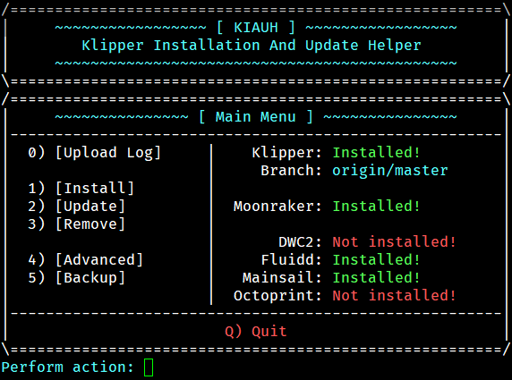

# **KIAUH - Klipper Installation And Update Helper**



---

## **📢 Disclaimer: Usage of this script happens at your own risk!**

This script acts as a helping hand for you to get set up in a fast and comfortable way.\
**This does not mean, it will relieve you of using your brain.exe! 🧠**\
Feel free to give it a try. If you have suggestions or encounter any problems, please report them.

---

## **🛠️ Instructions:**

For downloading this script it is best to have git already installed.\
If you haven't, please run `sudo apt-get install git -y` to install git first.\
You will need it anyways!

After git is installed, use the following commands in the given order to download and execute the script:

```shell
cd ~
git clone https://github.com/th33xitus/kiauh.git
cd kiauh
chmod +x kiauh.sh scripts/*
./kiauh.sh
```

## Additional Instructions:

If you need some more detailed instructions on how to install Klipper and Mainsail with KIAUH, check out this website:\
[Installing Klipper and Mainsail](https://3dp.tumbleweedlabs.com/firmware/klipper-firmware/installing-klipper-and-mainsail-on-your-raspberry-pi)\
Credits for these instructions go to [@tumbleweedlabs](https://github.com/tumbleweedlabs).\
Feel free to check out his work.

---

## **🧰 Functions and Features:**

### **Core Functions:**

- **Installing** of the Klipper Firmware to your Raspberry Pi or other Linux Distribution which makes use of init.d.
- **Installing** of several different web interfaces such as Duet Web Control, Mainsail, Fluidd or OctoPrint including their dependencies.
- **Installing** of the Moonraker API
- **Updating** of all the listed installations above excluding OctoPrint. For updating OctoPrint, please use the OctoPrint interface!
- **Removing** of all the listed installations above.
- **Backup** of all the listed installations above.

### **Also possible:**

- Build the Klipper Firmware
- Flash the MCU
- Read ID of the currently connected printer (only one at the time)
- Write necessary entries to your printer.cfg, some of them customizable right in the CLI.
- and more ...

### **For a list of additional features please see: [Feature List](docs/features.md)**

---

## **📝 Notes:**

- ### **Important changes to the script will be listed in the [Changelog](docs/changelog.md)**
- Tested **only** on Raspberry Pi OS Lite (Debian Buster)
- During the use of this script you might be asked for your sudo password. There are several functions involved which need sudo privileges.

---

## **🛈 Sources & Further Information**

For more information or instructions, please check out the appropriate repositories listed below:

---

### **⛵Klipper** by [KevinOConnor](https://github.com/KevinOConnor) :

https://github.com/KevinOConnor/klipper

---

### **⛵Klipper S-Curve fork** by [dmbutyugin](https://github.com/dmbutyugin) :

https://github.com/dmbutyugin/klipper/tree/scurve-smoothing \
https://github.com/dmbutyugin/klipper/tree/scurve-shaping

---

### **🌙Moonraker** by [Arksine](https://github.com/Arksine) :

https://github.com/Arksine/moonraker

---

### **💨Mainsail Webinterface** by [meteyou](https://github.com/meteyou) :

https://github.com/meteyou/mainsail

---

### **🌊Fluidd Webinterface** by [cadriel](https://github.com/cadriel) :

https://github.com/cadriel/fluidd

---

### **🕸️Duet Web Control** by [Duet3D](https://github.com/Duet3D) :

https://github.com/Duet3D/DuetWebControl

---

### **🕸️DWC2-for-Klipper-Socket** by [Stephan3](https://github.com/Stephan3) :

https://github.com/Stephan3/dwc2-for-klipper-socket

---

### **🐙OctoPrint Webinterface** by [OctoPrint](https://github.com/OctoPrint) :

https://octoprint.org \
https://github.com/OctoPrint/OctoPrint

---

## **❓ FAQ**

**_Q: Can i use this script to install multiple instancec of Klipper on the same Pi? (Multisession?)_**

**A:** No, and at the moment i don't plan to implement this function. For multisession installations take a look at this script manu7irl created: https://github.com/manu7irl/klipper-DWC2-installer . Keep in mind that klipper-DWC2-installer and KIAUH are **NOT** compatible with each other.
