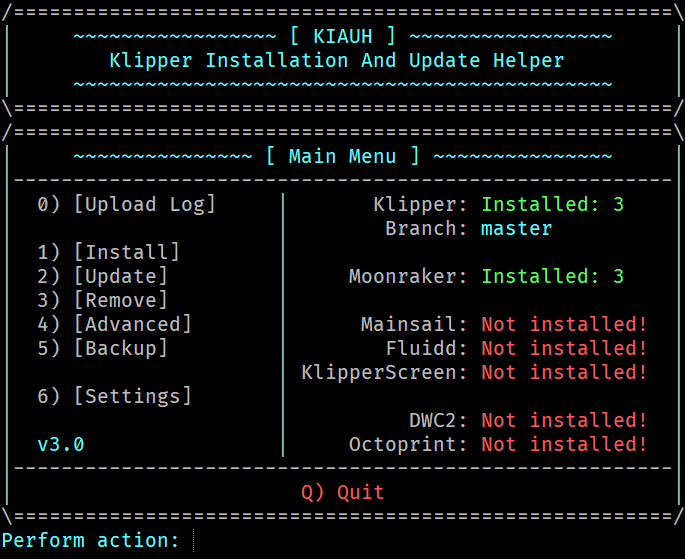

# **KIAUH - Klipper Installation And Update Helper**



---

## **📋 Please see the [Changelog](docs/changelog.md) for possible important information !**

---

## **📢 Disclaimer: Usage of this script happens at your own risk!**

This script acts as a helping hand for you to get set up in a fast and comfortable way.\
**This does not mean, it will relieve you of using your brain.exe! 🧠**\
Please also always pay attention to the individual component repositories (all linked below).\
Feel free to give it a try. If you have suggestions or encounter any problems, please report them.

---

## **🛠️ Instructions:**

For downloading this script it is necessary to have git installed.\
If you haven't, please run `sudo apt-get install git -y` to install git first.\
You will need it anyways! 😄

After git is installed, use the following commands in the given order to download and execute the script:

```shell
cd ~
git clone https://github.com/th33xitus/kiauh.git
./kiauh/kiauh.sh
```

---

## **🧰 Functions and Features:**

- **New in v3.0.0:** You can now install multiple instances (Klipper/Moonraker/DWC/Octoprint) on the same Pi!
---
### **Core Functions:**

- **Installing** Klipper to your Raspberry Pi or other Debian based Linux Distribution.
- **Installing** of the Moonraker API (needed for Mainsail, Fluidd and KlipperScreen)
- **Installing** several different web interfaces such as Mainsail, Fluidd, Duet Web Control or OctoPrint including their dependencies.
- **Installing** of KlipperScreen (OctoScreen but for Klipper!)
- **Updating** of all the listed installations above excluding OctoPrint. For updating OctoPrint, please use the OctoPrint interface!
- **Removing** of all the listed installations above.
- **Backup** of all the listed installations above.

### **Also possible:**

- Build the Klipper Firmware
- Flash the MCU
- Read ID of the currently connected MCU
- and more ...

### **For a list of additional features please see: [Feature List](docs/features.md)**

---

## **📝 Notes:**

- Tested **only** on Raspberry Pi OS Lite (Debian 10 Buster)
    - Other Debian based distributions can work
    - Reported to work on Armbian too
- During the use of this script you might be asked for your sudo password. There are several functions involved which need sudo privileges.

---

## **🛈 Sources & Further Information**

For more information or instructions to the various components KIAUH can install, please check out the corresponding repositories listed below:

---

### **⛵Klipper** by [KevinOConnor](https://github.com/KevinOConnor) :

https://github.com/Klipper3d/klipper

---

### **⛵Klipper S-Curve fork** by [dmbutyugin](https://github.com/dmbutyugin) :

https://github.com/dmbutyugin/klipper/tree/scurve-smoothing \
https://github.com/dmbutyugin/klipper/tree/scurve-shaping

---

### **🌙Moonraker** by [Arksine](https://github.com/Arksine) :

https://github.com/Arksine/moonraker

---

### **💨Mainsail Webinterface** by [meteyou](https://github.com/meteyou) :

https://github.com/meteyou/mainsail

---

### **🌊Fluidd Webinterface** by [cadriel](https://github.com/cadriel) :

https://github.com/cadriel/fluidd

---

### **🕸️Duet Web Control** by [Duet3D](https://github.com/Duet3D) :

https://github.com/Duet3D/DuetWebControl

---

### **🕸️DWC2-for-Klipper-Socket** by [Stephan3](https://github.com/Stephan3) :

https://github.com/Stephan3/dwc2-for-klipper-socket

---

### **🖥️KlipperScreen** by [jordanruthe](https://github.com/jordanruthe) :

https://github.com/jordanruthe/KlipperScreen

---

### **🐙OctoPrint Webinterface** by [OctoPrint](https://github.com/OctoPrint) :

https://octoprint.org \
https://github.com/OctoPrint/OctoPrint

---

### **🔬PrettyGCode for Klipper** by [Kragrathea](https://github.com/Kragrathea) :

https://github.com/Kragrathea/pgcode

---

### **🤖Telegram Bot for Moonraker** by [nlef](https://github.com/nlef) :

https://github.com/nlef/moonraker-telegram-bot

---

## **❓ FAQ**

**_Q: Can i use this script to install multiple instances of Klipper on the same Pi? (Multisession?)_**

**A:** Yes, it is finally possible 🙂
