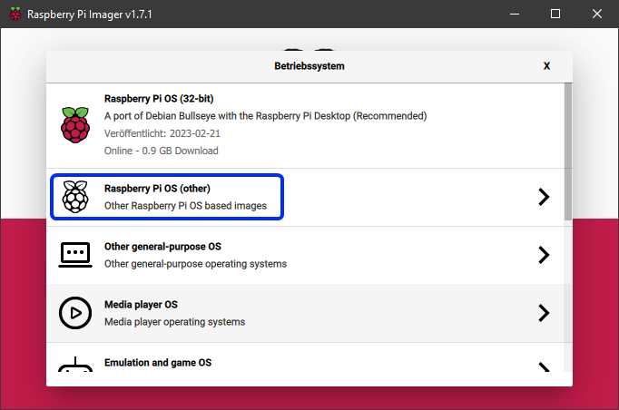
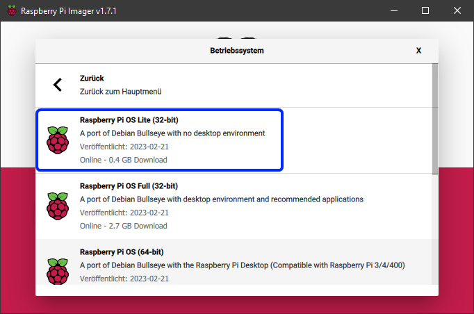

# KIAUH - Klipper 安装与更新助手

<p align="center">
  <a>
    
    <h1 align="center">Klipper Installation And Update Helper</h1>
  </a>
</p>

<p align="center">
  一个方便的安装脚本，让安装Klipper（以及更多组件）变得轻松！
</p>

<p align="center">
  <a href="README.md">English</a> ·
  <a href="README_zh.md">简体中文</a> ·
  <a href="README_zh_Hant.md">繁體中文</a>
</p>

<p align="center">
  <a></a>
  <a></a>
  <a></a>
  <a></a>
  <a></a>
  <br />
  <a></a>
  <a></a>
</p>

## 📄 使用说明

### 📋 系统要求
KIAUH 是一个帮助您在 Linux 系统上安装 Klipper 的脚本工具，
它需要一个已经写入树莓派（或其他单板计算机）SD 卡的 Linux 系统。
如果您使用树莓派，推荐使用 `Raspberry Pi OS Lite (32位或64位)` 系统镜像。
[官方 Raspberry Pi Imager](https://www.raspberrypi.com/software/) 是将此类镜像写入 SD 卡的最简单方式。

* 下载、安装并启动 Raspberry Pi Imager 后，
选择 `Choose OS -> Raspberry Pi OS (other)`:

<p align="center">
  
</p>

* 然后选择 `Raspberry Pi OS Lite (32位)` (或如果您想使用64位版本):

<p align="center">
  
</p>

* 返回 Raspberry Pi Imager 主界面，选择对应的 SD 卡作为写入目标。

* 确保点击左下角的齿轮图标（在主菜单中）
启用 SSH 并配置 Wi-Fi。

* 如果您需要更多关于使用 Raspberry Pi Imager 的帮助，请访问 [官方文档](https://www.raspberrypi.com/documentation/computers/getting-started.html)。

这些步骤**仅适用于**您实际使用树莓派的情况。如果您想使用其他单板计算机（如香橙派或其他 Pi 衍生产品），
请查找如何将合适的 Linux 镜像写入 SD 卡（通常使用 Balena Etcher）。
同时确保 KIAUH 能够在您要安装的 Linux 发行版上运行。
您在使用基于 Debian 11 Bullseye 的系统时可能会获得最佳体验。
请阅读本文档下方的注意事项。

### 💾 下载并使用 KIAUH

**📢 免责声明：使用此脚本的风险由您自行承担！**

* **第一步：**
要下载此脚本，需要先安装 git。
如果您不确定是否已安装 git，请运行以下命令：
```shell
sudo apt-get update && sudo apt-get install git -y
```

* **第二步：**
安装完 git 后，
使用以下命令将 KIAUH 下载到您的主目录：

```shell
cd ~ && git clone https://github.com/dw-0/kiauh.git
```

* **第三步：**
最后，通过运行以下命令启动 KIAUH：

```shell
./kiauh/kiauh.sh
```

* **第四步：**
您现在应该会看到 KIAUH 的主菜单。
根据您的选择，
您会看到几个可选操作。
要选择某个操作，只需在提示中输入对应的选项并按回车键确认。

### 🌐 语言 / 本地化

KIAUH 内置语言选择器：

- 在主菜单按 `L` 打开语言列表（English / 简体中文 / 繁體中文）
- 或进入 `S) [设置]` → 选项 `6) 语言`

KIAUH 使用 Python 标准库 `gettext`，缺失翻译时会安全回退为英文显示，不会导致程序崩溃。

## ❗ 注意事项

### **📋 请查看 [更新日志](docs/changelog.md) 以了解可能的重要更新！**

- 主要在 Raspberry Pi OS Lite (Debian 10 Buster / Debian 11 Bullseye) 上测试
    - 其他基于 Debian 的发行版（如 Ubuntu 20 到 22）也可能正常工作
    - 据报告在 Armbian 上也可用，但未进行详细测试
- 在使用此脚本的过程中，
您会被要求输入 sudo 密码。
因为有几个功能需要 sudo 权限。

<h2 align="center">⚙️ 核心组件 ⚙️</h2>

<table align="center" style="text-align: center;">
<tr>
    <th><h3><a href="https://github.com/Klipper3d/klipper">Klipper</a></h3></th>
    <th><h3><a href="https://github.com/Arksine/moonraker">Moonraker</a></h3></th>
    <th><h3><a href="https://github.com/mainsail-crew/mainsail">Mainsail</a></h3></th>
</tr>
<tr>
    <th></th>
    <th></th>
    <th></th>
</tr>
<tr>
    <th>由 <a href="https://github.com/KevinOConnor">KevinOConnor</a></th>
    <th>由 <a href="https://github.com/Arksine">Arksine</a></th>
    <th>由 <a href="https://github.com/mainsail-crew">mainsail-crew</a></th>
</tr>
<tr>
    <th><h3><a href="https://github.com/fluidd-core/fluidd">Fluidd</a></h3></th>
    <th><h3><a href="https://github.com/KlipperScreen/KlipperScreen">KlipperScreen</a></h3></th>
    <th></th>
</tr>
<tr>
    <th></th>
    <th></th>
    <th></th>
</tr>
<tr>
    <th>由 <a href="https://github.com/fluidd-core">fluidd-core</a></th>
    <th>由 <a href="https://github.com/alfrix">alfrix</a></th>
    <th></th>
</tr>
</table>

<hr>

<h2 align="center">🧩 社区扩展 🧩</h2>

<table align="center" style="text-align: center;">
<tr>
    <th><h3><a href="https://github.com/OctoPrint/OctoPrint">OctoPrint</a></h3></th>
    <th><h3><a href="https://github.com/nlef/moonraker-telegram-bot">Moonraker-Telegram-Bot</a></h3></th>
    <th><h3><a href="https://github.com/Kragrathea/pgcode">PrettyGCode for Klipper</a></h3></th>
</tr>
<tr>
    <th><a href="https://github.com/OctoPrint/OctoPrint"></a></th>
    <th><a href="https://github.com/nlef/moonraker-telegram-bot"></a></th>
    <th><a href="https://github.com/Kragrathea/pgcode"></a></th>
</tr>
<tr>
    <th>由 <a href="https://github.com/OctoPrint">OctoPrint</a></th>
    <th>由 <a href="https://github.com/nlef">nlef</a></th>
    <th>由 <a href="https://github.com/Kragrathea">Kragrathea</a></th>
</tr>
<tr>
    <th><h3><a href="https://github.com/TheSpaghettiDetective/moonraker-obico">Obico for Klipper</a></h3></th>
    <th><h3><a href="https://github.com/Clon1998/mobileraker_companion">Mobileraker's Companion</a></h3></th>
    <th><h3><a href="https://octoeverywhere.com/?source=kiauh_readme">OctoEverywhere For Klipper</a></h3></th>
</tr>
<tr>
    <th><a href="https://github.com/TheSpaghettiDetective/moonraker-obico"></a></th>
    <th><a href="https://github.com/Clon1998/mobileraker_companion"></a></th>
    <th><a href="https://octoeverywhere.com/?source=kiauh_readme"></a></th>
</tr>
<tr>
    <th>由 <a href="https://github.com/TheSpaghettiDetective">Obico</a></th>
    <th>由 <a href="https://github.com/Clon1998">Patrick Schmidt</a></th>
    <th>由 <a href="https://github.com/QuinnDamerell">Quinn Damerell</a></th>
</tr>
<tr>
    <th><h3><a href="https://github.com/crysxd/OctoApp-Plugin">OctoApp For Klipper</a></h3></th>
    <th><h3><a href="https://github.com/staubgeborener/klipper-backup">Klipper-Backup</a></h3></th>
    <th><h3><a href="https://simplyprint.io/">SimplyPrint for Klipper</a></h3></th>
</tr>
<tr>
    <th><a href="https://octoapp.eu/?source=kiauh_readme"></a></th>
    <th><a href="https://github.com/staubgeborener/klipper-backup"></a></th>
    <th><a href="https://github.com/SimplyPrint"></a></th>
</tr>
<tr>
    <th>由 <a href="https://github.com/crysxd">Christian Würthner</a></th>
    <th>由 <a href="https://github.com/Staubgeborener">Staubgeborener</a></th>
    <th>由 <a href="https://github.com/SimplyPrint">SimplyPrint</a></th>
</tr>
<tr>
    <th><h3><a href="https://github.com/CodeMasterCody3D/DroidKlipp">DroidKlipp</a></h3></th>
    <th><h3><a href="https://github.com/PEEKYPAUL/Moongate">Moongate</a></h3></th>
    <th></th>
</tr>
<tr>
    <th><a href="https://github.com/CodeMasterCody3D/DroidKlipp"></a></th>
    <th><a href="https://github.com/PEEKYPAUL/Moongate"></a></th>
    <th></th>
</tr>
<tr>
    <th>由 <a href="https://github.com/CodeMasterCody3D">CodeMasterCody3D</a></th>
    <th>由 <a href="https://github.com/PEEKYPAUL">PEEKYPAUL</a></th>
    <th></th>
</tr>
</table>

<hr>

<h2 align="center">🎖️ 贡献者 🎖️</h2>

<div align="center">
  <a href="https://github.com/dw-0/kiauh/graphs/contributors">
    
  </a>
</div>

<div align="center">
    
</div>

<hr>

<h2 align="center">✨ 特别感谢 ✨</h2>

* 非常感谢 [lixxbox](https://github.com/lixxbox) 设计了如此出色的 KIAUH 标志！
* 同时，非常感谢所有通过 [Ko-fi](https://ko-fi.com/dw__0) 支持我的工作的人！
* 最后但同样重要的是：感谢所有为 Klipper 社区做出贡献的成员，以及喜欢和分享这个项目的朋友们！
